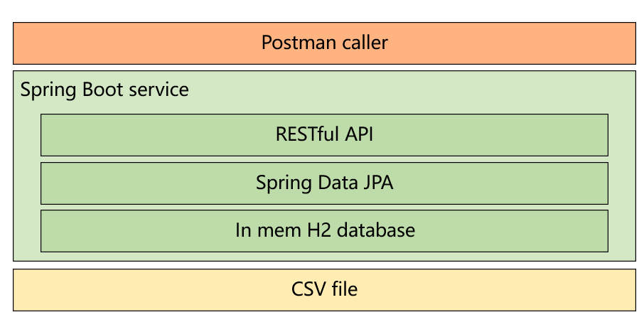

# food-truck-api

## Project Background
In San Francisco, the city releases a list of Food Trucks as open data. We can collect these data through our micro service and make some interesting things like helping our team members to find a good place to have lunch.

## Project Technology Stack
Spring Boot, Spring Data JPA, H2 database

### Main Version
|Dependency  | Version  |
|------------|----------|
|Spring Boot | 2.7.6    |
|Java        |  11      |
|OpenCsv     |  5.0     |

## Function Description
The source data of food trucks is saved in one CSV file. When we start the application, it will try to load the data from CSV and save all the values to separate column of the main table.

After application started successfully, the data should also be ready in H2 database.

Then we can try to call the following exposed API to do something dealing with food truck data.

### Available Api List

1. Get: http://localhost:8080/api/v1/food-facilities
2. Get: http://localhost:8080/api/v1/food-truck
3. Get: http://localhost:8080/api/v1/food-truck/item?foodName={the food name you want to search}

## How to Run in Local Environment
### 1. Clone the project to your local space.
### 2. Move to root folder and run "mvn spring-boot:run"
### 3. Open Postman and call the API to get results

## Outlook and Expectation
1. We can try to use map api to fetch user's location which can be used to find the nearest food truck.
2. We can have further analysis on food items which can enhance UX and recommendation function.
